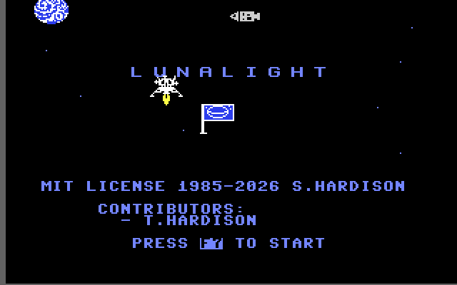

# lunalight

Commodore 64 lunar lander by Steven Hardison and Tyler Hardison
([MIT License](LICENSE)).



Canonical playable path: **`src/lunalight.bas`** compiled with the original
**Blitz!** disk [`tools/BLITZ.d64`](tools/BLITZ.d64), producing
[`build/lunalight-blitz-full.prg`](build/lunalight-blitz-full.prg). Physics remain
the original float equations from [`current/luna081426`](current/luna081426)
(`luna2`): unchanged gravity, thrust, drift and landing thresholds.

The canonical package is the **VIC-bank-2 build**. Relocating the screen, sprite
pointers and sprite shapes out of VIC bank 0 freed the `$2E7C` sprite region for
code, which is what made the previously omitted feature layers fit. It carries a
three-voice title soundtrack, the TOD-entropy RNG, procedural terrain with
generated landing pads, the refuel-pad flag sprite, joystick port 2 with keyboard
fallback, the crash post-mortem text, and attract mode.

A runnable fallback remains: **`archived/lunalight-bank0.bas`** is the exact
pre-promotion bank-0 source, built by `make blitz-bank0`. It is outside `src/`
so that directory contains only the current canonical source and its active
assembly helpers.

Layer evidence and measured results:
[`docs/feature-layering.md`](docs/feature-layering.md).
Section map of the canonical BASIC source:
[`docs/lunalight-bas.md`](docs/lunalight-bas.md).

## Lineage

| File | Role |
| ---- | ---- |
| [`src/lunalight.bas`](src/lunalight.bas) | **Canonical** promoted bank-2 feature build (formerly `src/lunalight-bank2.bas`, now folded in so only one canonical source exists) |
| [`src/music.s`](src/music.s) | Three-voice IRQ title soundtrack (embedded at `$4200`) |
| [`src/rng.s`](src/rng.s) | TOD-entropy collector and PRNG table at `$4400-$4BFF`; **used** by the canonical package for terrain generation |
| [`archived/luna081426.bas`](archived/luna081426.bas) | Exact detokenized `luna2` baseline; `make verify-baseline` retokenizes to byte-identical [`current/luna081426`](current/luna081426) |
| [`archived/lunalight-bank0.bas`](archived/lunalight-bank0.bas) | **Archived fallback/control**: exact pre-promotion bank-0 source (baseline plus correctness fixes and IRQ music) |
| [`tools/BLITZ.d64`](tools/BLITZ.d64) | **Required tracked input**: original C64 Blitz! compiler disk (`blitz compiler`). Do not modify |
| [`current/luna081426`](current/luna081426) | Baseline tokenized PRG — source-of-truth for the baseline round-trip |
| [`current/luna081426-old`](current/luna081426-old) | Earlier `LUNAON4A` tokenized PRG (historical) |
| [`sprites/lsprite.prg`](sprites/lsprite.prg) / [`current/lsprite`](current/lsprite) | Original sprite shapes at `$2E7C`; unmodified |
| [`historical/lunalight-optimized.bas`](historical/lunalight-optimized.bas) | Prior evolved source (fixed-point physics, Mars, etc.) — reference only |
| [`historical/lunalight-m3x1.bas`](historical/lunalight-m3x1.bas) | Reference: 2024 M3X1 rewrite |
| [`historical/lunalight-experimental.bas`](historical/lunalight-experimental.bas) | Reference: 2024 LUNAON1 fork |
| [`historical/lunalight-1985.bas`](historical/lunalight-1985.bas) | Reference: 1985 LIST decompilation |
| [`historical/LUNALIGH.D64`](historical/LUNALIGH.D64) | Historical 1985 disk image |

Source text is lowercase: `petcat` maps lowercase ASCII to PETSCII uppercase.

## What the canonical build contains

Retained from the baseline and required by the motion oracle: float gravity and
thrust (`m2±.6`, `po` via `.1+m2/20`, `hm/4` drift), soft-landing thresholds
`|hm|≤2` and `int(m2)≤5`, the ±90° rotation limiter, and the five-pad scoring
shape. No physics constant or formula was altered by the promotion.

Retained correctness fixes from the bank-0 lineage: 40-column message-row erasure
(`bl$`), explosion pointers assigned before the explosion sprites are enabled and
refreshed before each frame delay, and 9-bit pad X so pads right of x=255
register.

Added by the promotion (all verified, see below):

| Feature | Implementation |
| ------- | -------------- |
| VIC bank 2 | `$DD00` low bits `01`, `poke648,132`, `$D018=$14`; screen `$8400`, pointers `$87F8`, sprites rebased to `$AE7C` |
| Title soundtrack | Three voices: triangle bass plucked once per chord and left to decay, sawtooth melody under a low-pass cutoff sweep locked to the harmony, and a pulse pad holding a tone of the chord now sounding. One step is one beat at 22 ticks of the 60 Hz KERNAL interrupt (164 BPM), and the chord turns over every 4 beats; the 32-step C-minor theme plus 16-step bridge is one 17.6 s loop. `SYS 16896` installs the player embedded at `$4200-$43F0`; `SYS 16899` restores the KERNAL IRQ and silences the SID, so flight and attract run without music and leave the chip to the engine and explosion effects. The player also publishes its loop length in jiffies (`sequence_length * step_ticks`) as a `.word` at `$4206/$4207`, read as `PEEK(16902)+PEEK(16903)*256`, so the title's attract timeout equals one song pass and tracks any tempo or length change |
| RNG | `SYS 17408` collects TOD-phase entropy (~3.2 s before the title), `SYS 17411` refills the 1024-byte table at `$4800`; BASIC reads it with `PEEK(18432+ri)`. Line 30 must call it **before** `SYS 16896`: the collector commandeers SID voice 3 for oscillator noise, and the music player rewrites `$D412` every frame |
| Procedural terrain | A random-walk height map across all 40 columns, redrawn every game, with slope smoothing around each pad |
| Landing pads | Five generated pads, always four glyphs (32 pixels) wide, with `px`/`pw`/`py` geometry, `pb()` point values (500/600/800 by altitude band), and centre-hit bonus `pb*2/3`. The fixed width gives the 24-pixel LEM four pixels of visual clearance on each side, including inset pads. The verdict compares the lander's centre, `INT(pp)+12`, because `px()` is the sprite-X of the pad's *left* edge |
| Refuel pad | One low pad per game carries `rf()`; landing there refills fuel to 1000 and prints “fuel tanks full” |
| Refuel flag sprite | The flag shape is patched into the original payload’s spare slot 243 by [`tools/make-shapes.py`](tools/make-shapes.py), then the whole payload is rebased so slot 243 resolves to `$BCC0`. Drawn on sprite 4, white, unexpanded. The pennant carries an Earth wire-globe emblem, and a solid pennant field from spare slot 245 (`$BD40`) sits on sprite 5 at the same coordinates in blue, one priority step behind, so the emblem and mast read as white on blue. This is the Earth decoration’s two-sprite layover: a single sprite could only draw the outline, which read as an empty wire frame, and colours 11 and 12 are unavailable because the terrain is painted in those greys |
| Opaque LEM interior | Five black cabin masks in spare slots 246-250 match the reachable attitudes 187, 188, 189, 193 and 194. Sprite 1 draws the selected mask behind the sprite-0 wireframe but ahead of the scenery sprites, preventing the flag or terrain from showing through while leaving the antenna and landing legs open. Exhaust moved from sprite 1 to sprite 6 |
| Command module | A cosmetic spacecraft holding station in the sky, patched into spare slot 244 (`$BD00`) and drawn on sprite 7, light grey, at Y 55. Sprite 7 is otherwise explosion-only, so line 1212 re-establishes its pointer, colour, position and enable bit after every round. It steps 8 pixels right per round and wraps at X 240, which reads as orbital motion without costing anything in the flight loop |
| Joystick | Port 2 (`PEEK(56320)`) for rotate and thrust, with the original keyboard controls kept as a fallback |
| Crash post-mortem | Exactly one line per crash. An RNG-table coin flip picks either a cause line derived from the crash state (tilt, sideways, velocity, off-pad) or one of 13 `DATA` consequence lines, rotated by `PEEK(162)` |
| Attract mode | One title-song loop of idle (17.6 s at 164 BPM, read from the player's published loop length) starts a float autopilot demo; any key or joystick input defers it. The demo never writes the high score. Each flight uses the normal `ep`/`hp` spawn and momentum sequence and selects a random pad without immediately repeating one. It crosses high, releases into a ballistic dive 90 pixels out, and finishes with one continuous late burn that bends onto the pad. The first three approaches aim at the centre for the bonus; every fourth deliberately aims just outside the left edge and crashes, demonstrating failure at an exact 25% cadence. It diverts to the refuel pad below 400 fuel |

The original sprite payload, the physics constants, the oracle tolerances and the
motion fixture are unchanged by the promotion. Only the sprite payload’s **load
address** is rebased; its bytes are untouched apart from the flag, command module,
pennant field and LEM fills written into the previously empty slots 243-250.

## Controls

| Input | Action |
| ----- | ------ |
| Joystick 2 left / right | Rotate lander (±90° from upright) |
| Joystick 2 fire | Thrust |
| `{rght}` / `{down}` | Rotate lander (keyboard fallback) |
| Shift / Ctrl / C= (`PEEK(653)`) | Thrust (keyboard fallback) |
| `F1` | Pause / resume |
| `F7` | Start, and restart after game over |
| `{home}` while paused | Stop to BASIC (`luna2`) |
| Any input during attract | Return to the title screen |

## Build / run

Requires `petcat`, `x64sc`, `c1541` (VICE), and `ca65`/`ld65` (cc65). The
original Blitz compile also needs the tracked disk
[`tools/BLITZ.d64`](tools/BLITZ.d64).

Windows setup, including WSL2, VICE, and Cursor: [docs/windows-setup.md](docs/windows-setup.md).

### Canonical (promoted bank-2, original Blitz!)

```bash
make                 # build/lunalight-blitz-full.prg
make blitz           # same
make blitz-bank2     # alias of the above; the canonical package *is* bank 2
make run             # x64sc autostart of the canonical full PRG
make run-bank2       # alias of make run
make d64             # build/lunalight.d64 — self-contained canonical full PRG as LUNALIGHT
make d64-boot        # directory listing + headless boot screenshot of that disk
make smoke           # warp headless title screenshot of the canonical artifact
make bench           # normal-speed run of the canonical artifact
make gif             # regenerate docs/lunalight-gameplay.gif (title + attract)
make clean
```

`LOAD"*",8,1` then `RUN` on the D64 (or autostart the full PRG). Sprites, music
and the RNG are already embedded; do not use the bare `lunalight-blitz.prg` for
play.

The canonical load image spans `$0801-$C073`, so a single `,8,1` load moves about
47 KB over the serial bus — roughly three times the bank-0 fallback. Measured with
`-warp`: still loading at 110,000,000 cycles, title screen up at 130,000,000.
`SMOKE_CYCLES` is therefore 135,000,000, which lands inside the title's
~18-second song-loop window before attract mode starts, and `BENCH_CYCLES` is 200,000,000 so
the unwarped run covers the load, the title and normal-speed attract flight (about
100 s of wall clock, since the SID dump device does not throttle to 100%). Decode
any screenshot with
`python3 tools/readscreen.py build/lunalight-blitz-full-smoke.png`.

### Bank-0 fallback

```bash
make blitz-bank0     # build/lunalight-bank0-blitz-full.prg from archived/lunalight-bank0.bas
make run-bank0       # x64sc autostart of the fallback
```

The fallback uses the original sprites at `$2E7C` and music at `$4200`; it has no
RNG, procedural terrain, flag, joystick, crash text or attract mode. It is also
the artifact the verifier flies as the bank-0 collision-latch control, and its
source is the byte-identity control for the shared scoring lines. It predates the
title-only soundtrack, so it never calls `SYS 16899` and its music plays through
flight; the player restores its own envelopes on each note step, so the in-game
SID clear at line 990 costs it one step of tone rather than silencing it.

### Verification

```bash
make verify-baseline        # archived/luna081426.bas ↔ current/luna081426
make verify-blitz-motion    # canonical bank-2 motion oracle vs the original fixture
make verify-bank2-motion    # same target under its bank-2 name
make verify-blitz-gameplay  # canonical aggregate: motion oracle + full runtime suite
make verify-bank2           # the runtime suite alone
make verify-bank2-capacity  # capacity artifact: motion oracle + suite + filler integrity
make verify-bank0-motion    # motion oracle against the bank-0 fallback
make record-blitz-baseline  # explicit fixture mutation only — do not run casually
```

`verify-blitz-motion` reads the relocated screen (`$8400`) and pointer table
(`$87F8`) and compares the promoted artifact against the **unchanged** bank-0
motion fixture within its recorded tolerances.
`record-blitz-baseline` is bound to the bank-0 fallback at bank-0 addresses,
because the fixture describes that lineage.

The verifier’s `--mode strict` additionally requires the whole decoded screen to
match the fixture. That only ever described the bank-0 static-terrain screen, so
it is not a canonical gate: the promoted build draws procedural terrain that
differs every game by design. The canonical aggregate replaces it.

VICE-driven targets own the emulator and its monitor port, so the Makefile
declares `.NOTPARALLEL`; do not run them with `make -j`.

### Alternate toolchains

MOSpeed compiles the canonical source with the same music, RNG and rebased
bank-2 sprite assets as the original-Blitz package. Its generated code relocates
around `$4200-$4BFF`; packaging fills those holes and appends sprites at
`$AE7C`. MOSpeed remains an alternate compiler and does not replace the
original-Blitz shipping artifact.

Every in-game pause (landing, between rounds, score display, sound envelope and
each explosion frame) is a fixed jiffy-clock delay via the `wait` entry in
[`src/rng.s`](src/rng.s) (`POKE 679,n:SYS 17420`), not an empty `FOR` loop. Empty
loops measure CPU work, so Blitz and MOSpeed would time them differently and
MOSpeed's optimizer would delete them entirely; reading the KERNAL jiffy clock
makes the pauses identical under both compilers.

Interpreted BASIC and Reblitz remain archived bank-0 lineage paths.

| Target | Output | Notes |
| ------ | ------ | ----- |
| `make prg` | `build/lunalight.prg`, `build/lunalight-bank0.prg` | `lunalight.prg` is the readable tokenized source, not a standalone game: its music, RNG, and rebased sprites live at separate fixed addresses. Combining those bank-2 assets into one BASIC PRG makes BASIC V2 treat the final asset byte as program memory and fail with `OUT OF MEMORY`. |
| `make full` | `build/lunalight-bank0-full.prg` | Interpreted BASIC + flag sprites + music + RNG embed, bank-0 layout |
| `make run-basic` | — | Autostart the interpreted bank-0 full PRG |
| `make mospeed` | `build/lunalight-mospeed-full.prg` | MOSpeed cross-compile of canonical `src/lunalight.bas` + bank-2 assets |
| `make run-mospeed` | — | Autostart the MOSpeed bank-2 full PRG |
| `make d64-mospeed` | `build/lunalight-mospeed.d64` | MOSpeed PRG + canonical `.bas` + `music` + `rng` |
| `make reblitz` | `build/lunalight-bank0-reblitz.prg` | **Experimental** JS Reblitz64 port of the bank-0 source; overruns sprites; not packaged |

MOSpeed needs Java and downloads `tools/mospeed/basicv2.jar` on first use.
Reblitz needs a local `tools/reblitz64` checkout (gitignored).

### Compiler distinctions

| Compiler | What it is | Role here |
| -------- | ---------- | --------- |
| **Original Blitz!** (`tools/BLITZ.d64`) | C64 Blitz!/Austro-Speed run under VICE via [`tools/blitz-compile.py`](tools/blitz-compile.py) | **Canonical** playable binary |
| **Reblitz64** | Host-side JS reimplementation | Experimental only; not the original Blitz! compiler |
| **MOSpeed** | Java 6502 BASIC V2 cross-compiler | Alternate; different codegen and packaging |
| **Interpreted BASIC V2** | `petcat` tokenize + embed | Slow; useful for source debugging |

## Memory map (canonical bank-2 package)

CPU-side load image, single `,8,1` load:

| Range | Contents |
| --- | --- |
| `$0801`–`$3654` | Blitz machine code (11,862-byte PRG for the promoted source) |
| `$3655`–`$41FF` | Free: BASIC/Blitz variables and arrays grow up from here; 2,987 bytes of headroom to the music player |
| `$4200`–`$43F0` | Three-voice title soundtrack player (loop length published at `$4206/$4207`); 15 bytes of slack before the RNG |
| `$4400`–`$47FF` | RNG entry points (`collect`, `refill`, `stir`) |
| `$4800`–`$4BFF` | 1024-byte PRNG table BASIC PEEKs |
| `$8400`–`$87FF` | Screen matrix and sprite pointers, also seen by the VIC below |
| `$9FFF` downward | BASIC string heap (`MEMSIZ $A000`). The screen lies in its descent path and `STREND` is too low for BASIC to collect on its own, so line 840 forces one collection per round with `gc=fre(.)` |
| `$AE7C`–`$C073` | Sprite shapes, rebased from `$2E7C`; flag in slot 243, command module in slot 244, flag pennant field in slot 245 |

What the VIC sees in bank 2 (`$8000-$BFFF`):

| Range | Contents |
| --- | --- |
| `$8400`–`$87E7` | Screen matrix (`poke648,132`, `$D018=$14`) |
| `$87F8`–`$87FF` | Sprite pointers |
| `$9000`–`$97FF` | Character ROM image. `$D018` must select this; `$18` selects blank RAM at `$A000`, which makes the display invisible and prevents the sprite/background collision latch that gates landing |
| `$AEC0`–`$B0BF` | Lander shapes, pointers 187-194 |
| `$B2C0`–`$BCBF` | Explosion shapes, pointers 203-242 |
| `$BCC0`–`$BCFF` | Refuel flag, pointer slot 243 |
| `$BD00`–`$BD3F` | Command module, pointer slot 244 |
| `$BD40`–`$BD7F` | Refuel flag pennant field, pointer slot 245 |
| `$BF40`–`$BFBF` | Decoration shapes, pointers 253 and 254 |

`$D018` reads back as `$15` because bit 0 is unused. The sprite payload’s tail
runs past `$C000`, outside the bank; every pointer the game actually uses
(187-194, 203-242, 243-245, 253, 254) resolves below `$BFFF`, which the verifier
checks. `tools/embed-sprites.py` fails the build if segments would overlap.

The bank-0 fallback keeps the original layout: code `$0801-$2DC4`, sprites
`$2E7C-$4073`, music `$4200-$43F0`, screen `$0400`, pointers `$07F8`.

## Verification workflow

1. `make verify-baseline` — exact tokenized match for the frozen `luna081426` text.
2. `make` / `make blitz` — original compiler disk → `lunalight-blitz.prg` → embed music, RNG and rebased flag sprites → `lunalight-blitz-full.prg`.
3. `make verify-blitz-gameplay` — the canonical aggregate: the six-sample motion oracle at bank-2 addresses plus the runtime suite (title, HUD, procedural terrain rows, generated pads and their colour pattern, refuel flag sprite, sprite residency, BASIC memory pointers, pause tile, joystick and keyboard controls, collision latch, explosion progression, the single-line crash post-mortem, attract mode with repeatable autopilot landings, string-heap reclamation between rounds, and a bank-0 control descent).
4. `make verify-bank2-capacity` — proves the freed region is genuinely usable: the padded artifact still passes the motion oracle and the suite, and the filler above BASIC’s live data is byte-intact.
5. `make smoke` / `make bench` — title screenshots of the canonical artifact.
6. `make d64` / `make d64-boot` — package `build/lunalight.d64` (one 186-block `lunalight` PRG, 478 blocks free) and boot it headless; the exit screenshot decodes to the title screen.

Measured results for each layer are in
[`docs/feature-layering.md`](docs/feature-layering.md).

Subjective handling still needs manual confirmation; the oracle catches timing and
position drift, not feel.

## Tools

| Tool | Use |
| ---- | --- |
| [`tools/blitz-compile.py`](tools/blitz-compile.py) | Drive original Blitz! under VICE binary monitor |
| [`tools/verify-blitz-gameplay.py`](tools/verify-blitz-gameplay.py) | Record/compare Blitz gameplay traces (motion and strict modes) |
| [`tools/verify-bank2.py`](tools/verify-bank2.py) | Canonical layout and runtime suite |
| [`tools/bank2-capacity.py`](tools/bank2-capacity.py) | Measure bank-2 headroom and emit the padded capacity artifact |
| [`tools/rebase-prg-load.py`](tools/rebase-prg-load.py) | Change a PRG load address without touching its payload |
| [`tools/make-shapes.py`](tools/make-shapes.py) | Write the refuel flag, command module and the flag’s pennant field into spare sprite slots 243, 244 and 245 |
| [`tools/vice_monitor.py`](tools/vice_monitor.py) | Shared VICE monitor helpers |
| [`tools/embed-sprites.py`](tools/embed-sprites.py) | Merge PRG + address-sorted asset PRGs |
| [`tools/attract-sim.py`](tools/attract-sim.py) | Python sim of the attract/terrain path |
| [`tools/make-gameplay-gif.py`](tools/make-gameplay-gif.py) | Capture the README title+attract GIF via VICE’s binary monitor |
| [`tools/readscreen.py`](tools/readscreen.py) | Decode VICE screenshots via character ROM |

Note: the lander collides with any character on screen; debug text below row 7
causes false crashes.

## License

Released under the [MIT License](LICENSE). Copyright (c) 1985 Steven Hardison;
copyright (c) 2026 Steven Hardison.
